# 📸 Sybau Picture - Visual Showcase

> **See Sybau Picture in Action**  
> **🌐 Try Live**: [sybaupicture.com](https://sybaupicture.com) | **🇨🇳 中文版**: [sybaupicture.com/zh](https://sybaupicture.com/zh)

---

## 🎭 Platform Overview

### 🏠 Homepage Experience

#### Hero Section - AI Image Generation Studio
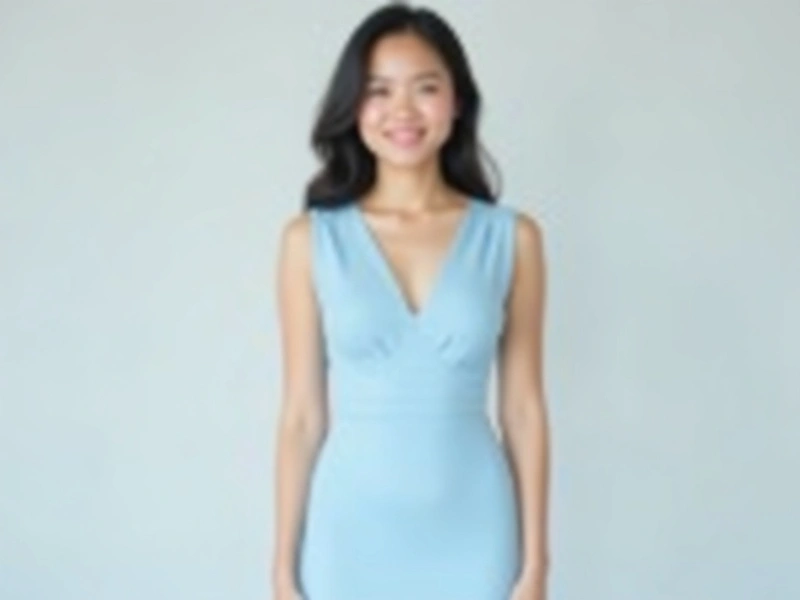
*Clean, professional interface with intuitive AI generation tools*

**Key Features Shown:**
- ⚡ 15-second generation promise
- 🎨 9 professional templates
- 🌍 Dual-language support (English/Chinese)
- 🚀 Prominent call-to-action buttons

---

## 🎨 AI Generation Interface

### 🖼️ Image-to-Image Mode

#### Template Showcase with Before/After Comparison
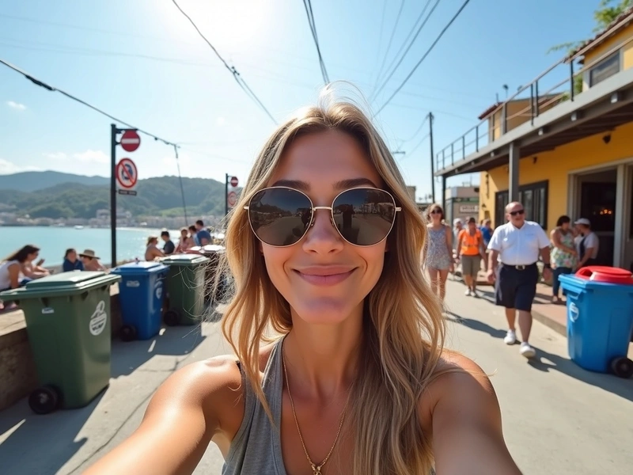
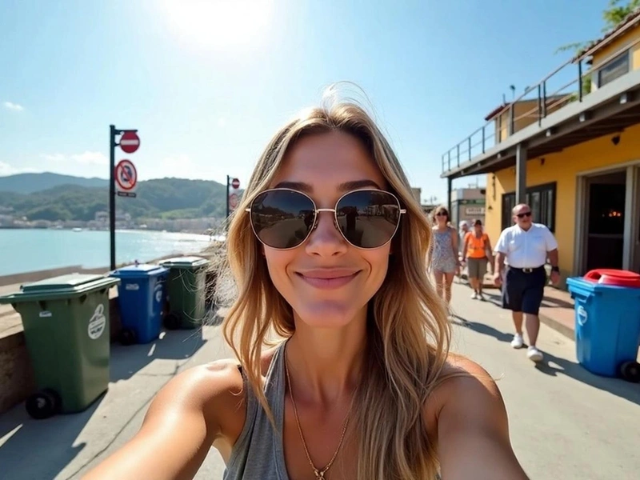
*Professional watermark removal demonstration*

**Interface Elements:**
- 📱 **Responsive Design**: Perfect mobile and desktop experience
- 🎯 **Template Library**: 9 professional scenarios
- ⚙️ **Style Controls**: 4 distinct artistic styles
- 📊 **Real-time Preview**: Instant result visualization

### ✨ Text-to-Image Mode

#### Creative Text Prompt Interface
```
User Input: "A professional business portrait with natural lighting"
↓ AI Processing (15 seconds)
Result: High-quality professional headshot
```

**Features Highlighted:**
- 📝 **Smart Prompt Understanding**: Advanced AI interpretation
- 🎨 **Style Variations**: Classic, Professional, Expressive, Creative
- ⚡ **Fast Generation**: Sub-15-second processing
- 💾 **Instant Download**: High-resolution output

---

## 🛠️ Template Gallery

### 🌟 Life Enhancement Templates

#### 1. Watermark Removal
| Before | After |
|--------|-------|
| 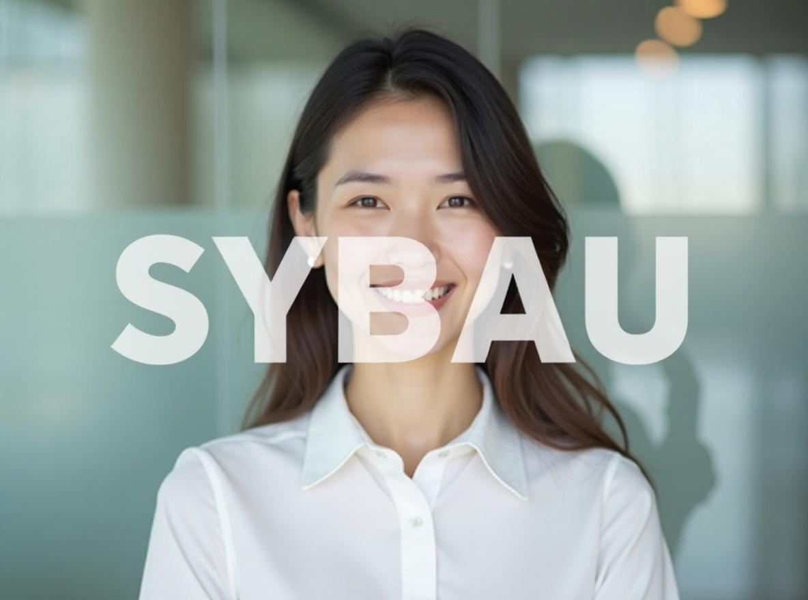 |  |
| *Image with visible watermark* | *Clean, professional result* |

#### 2. Body Shape Optimization
| Before | After |
|--------|-------|
| 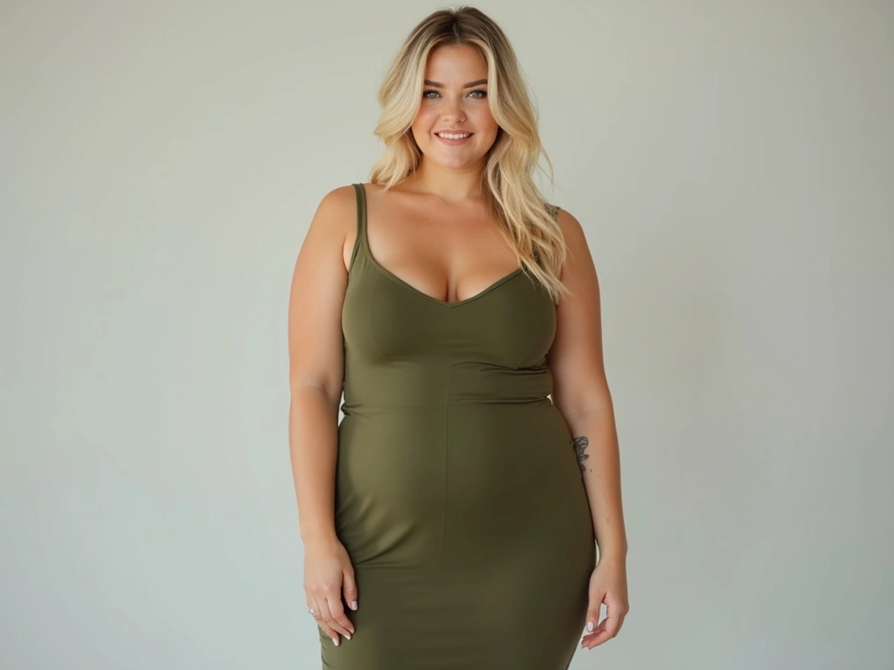 | 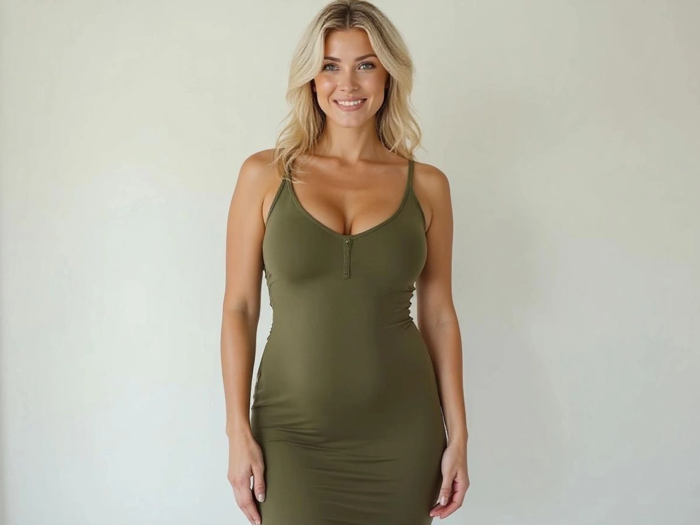 |
| *Original portrait* | *Natural enhancement* |

#### 3. Tourist/Object Removal
| Before | After |
|--------|-------|
| 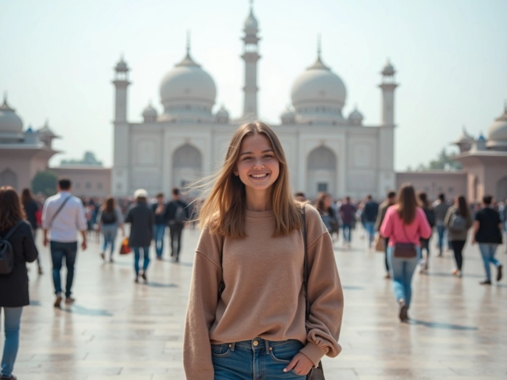 | 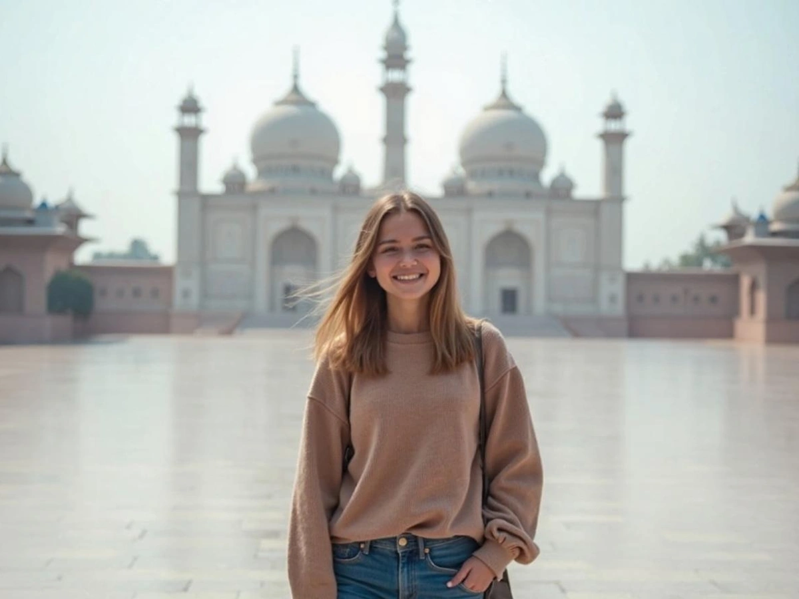 |
| *Crowded scene* | *Clean, empty space* |

### 💼 Business Creation Templates

#### 4. Product Enhancement
| Before | After |
|--------|-------|
|  | 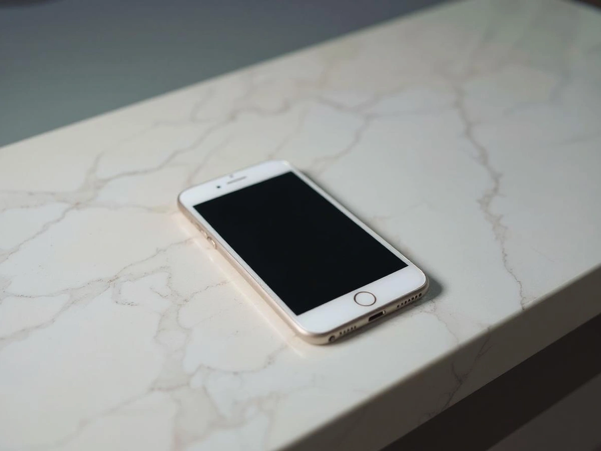 |
| *Basic product photo* | *Professional e-commerce ready* |

#### 5. Background Replacement
| Before | After |
|--------|-------|
|  |  |
| *Casual background* | *Professional studio background* |

#### 6. Text Content Integration
| Before | After |
|--------|-------|
| 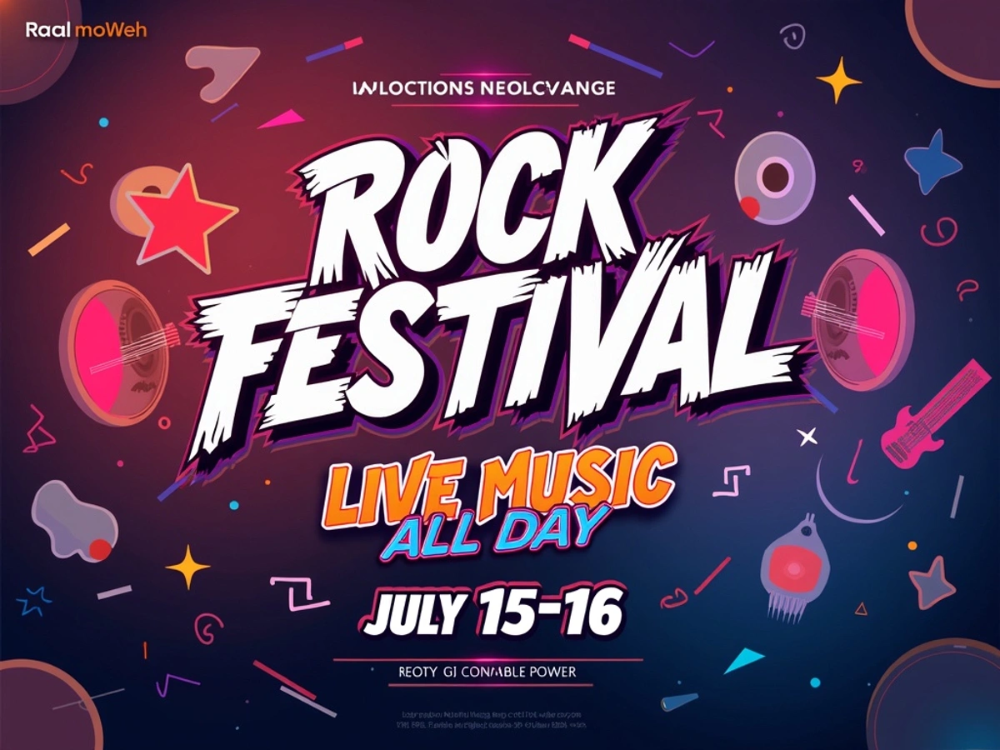 | 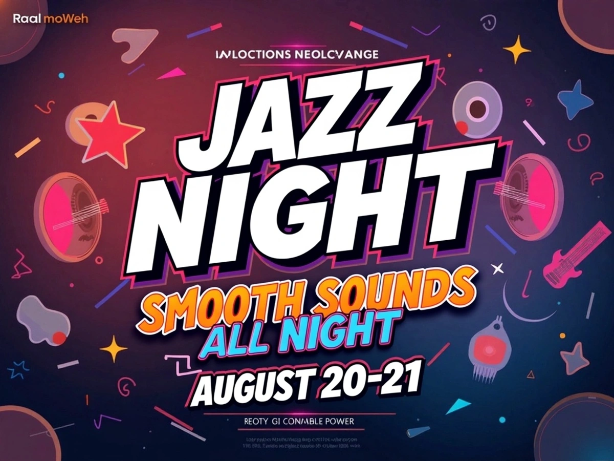 |
| *Plain image* | *Professional text overlay* |

### 🎨 Creative Enhancement Templates

#### 7. Style Transformation
| Before | After |
|--------|-------|
|  | 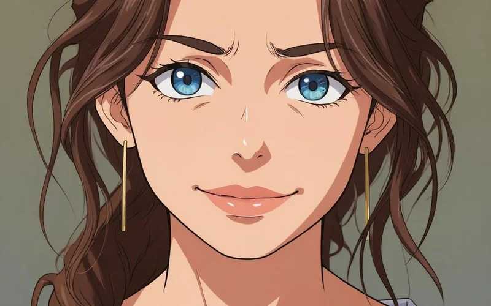 |
| *Original photo* | *Artistic style transformation* |

#### 8. Detail Enhancement
| Before | After |
|--------|-------|
| 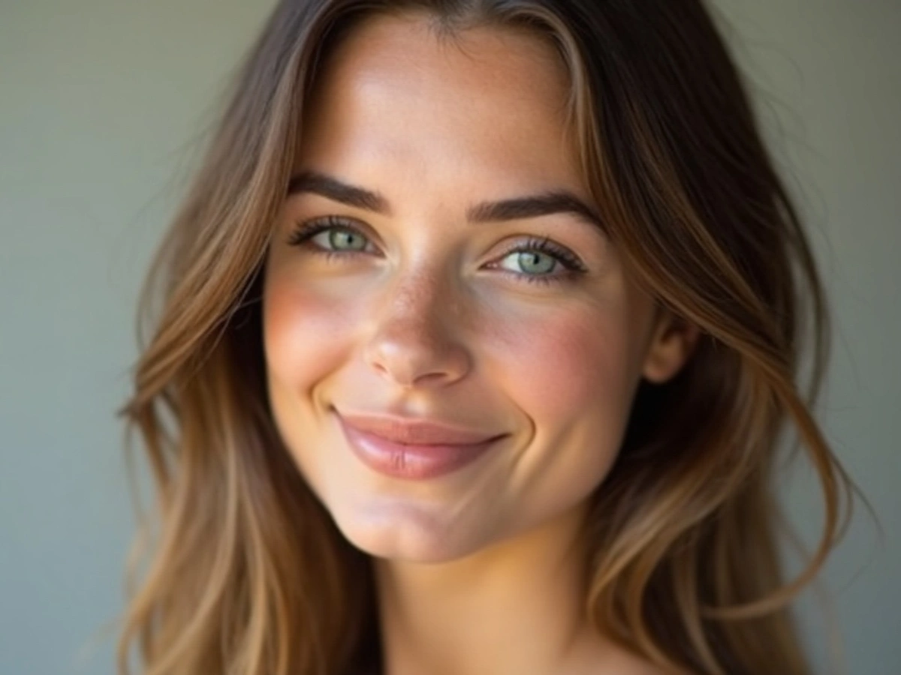 | 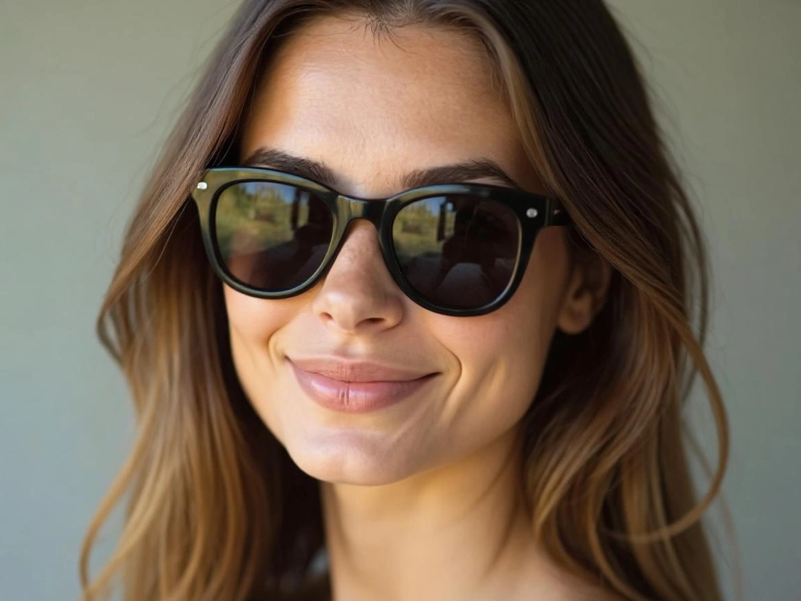 |
| *Basic quality* | *Enhanced details and clarity* |

#### 9. Creative Effects
| Before | After |
|--------|-------|
|  | 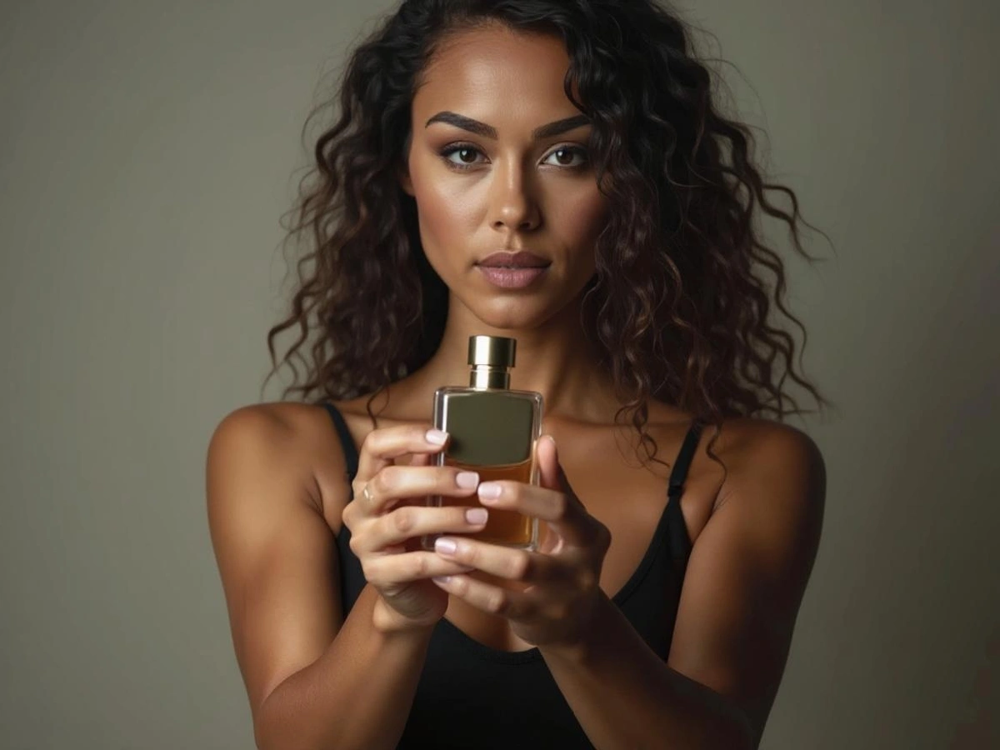 |
| *Standard photo* | *Creative artistic effects* |

---

## 📱 Mobile Experience

### 📲 Responsive Design Showcase

#### Mobile Interface
- **Touch-Optimized**: Intuitive touch controls
- **Fast Loading**: Optimized for mobile networks
- **Full Functionality**: No feature limitations on mobile
- **Gesture Support**: Pinch to zoom, swipe navigation

#### Tablet Experience
- **Large Screen Optimization**: Better preview visualization
- **Multi-touch Support**: Advanced gesture controls
- **Landscape Mode**: Optimized horizontal layout
- **Stylus Compatible**: Professional drawing tablet support

---

## 🔐 Authentication Flow

### 🚪 Login Experience

#### Google OAuth Integration
```
Click "Sign in with Google" → Google Auth → Instant Access → Start Creating
```

**Security Features:**
- 🔒 **Secure OAuth**: Industry-standard Google authentication
- ⚡ **One-Click Login**: Instant access without passwords
- 🛡️ **Privacy Protected**: No password storage required
- 🔄 **Session Management**: Seamless cross-device experience

#### Traditional Email Registration
```
Email + Password → Email Verification → Account Activation → Platform Access
```

---

## 💳 Subscription Management

### 💰 Pricing Interface

#### Plan Comparison
| Feature | Free | Standard ($9/mo) | Professional ($19/mo) |
|---------|------|------------------|----------------------|
| Monthly Generations | 3 | 60 | 180 |
| Image Quality | 1024x1024 | 1536x1536 | 2048x2048 |
| Template Access | Basic | All Templates | All + Exclusive |
| Commercial License | ❌ | ❌ | ✅ |

#### Payment Flow
```
Select Plan → Stripe Checkout → Payment Confirmation → Instant Activation → Full Access
```

**Payment Features:**
- 💳 **Secure Processing**: Stripe-powered payments
- 🌍 **Global Cards**: Worldwide payment support
- 🔄 **Easy Management**: One-click plan changes
- 📧 **Instant Receipts**: Automated invoice generation

---

## 📊 User Dashboard

### 📈 Usage Analytics

#### Monthly Usage Tracking
- **Generation Counter**: Real-time usage display
- **Remaining Credits**: Clear limit visualization
- **Usage History**: Detailed generation logs
- **Plan Status**: Current subscription overview

#### History Management
- **Generated Images**: Browse all past creations
- **Download Options**: Re-download previous results
- **Search & Filter**: Find specific generations
- **Batch Operations**: Bulk download capabilities

---

## 🌍 Multi-Language Support

### 🔄 Language Switching

#### English Interface

*Clean, professional English interface*

#### Chinese Interface (中文)
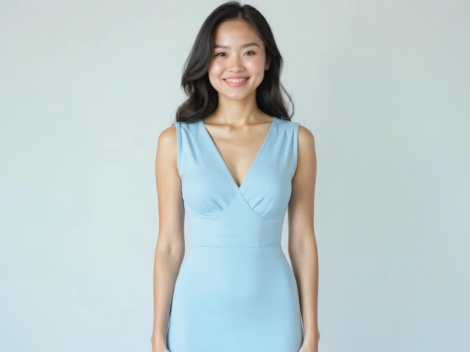
*Localized Chinese interface with cultural adaptations*

**Localization Features:**
- 🌐 **Complete Translation**: Every interface element
- 🔗 **SEO-Friendly URLs**: Language-specific routing
- 🎨 **Cultural Adaptation**: Appropriate visual elements
- ⚡ **Smart Detection**: Automatic language detection

---

## 🎯 Real-World Use Cases

### 📸 Photography Enhancement

#### Professional Portrait Improvement
**Before Processing:**
- Raw camera output
- Unwanted background elements
- Lighting imperfections

**After Sybau Picture:**
- Professional studio quality
- Clean, distraction-free background
- Optimized lighting and exposure

### 🛍️ E-commerce Product Photos

#### Product Photography Optimization
**Before Processing:**
- Casual product shots
- Inconsistent backgrounds
- Poor lighting conditions

**After Sybau Picture:**
- Professional e-commerce ready
- Consistent white backgrounds
- Studio-quality lighting

### 📱 Social Media Content

#### Social Media Enhancement
**Before Processing:**
- Basic smartphone photos
- Crowded backgrounds
- Amateur lighting

**After Sybau Picture:**
- Engaging social media content
- Professional appearance
- Optimized for platform requirements

---

## 📈 Performance Demonstrations

### ⚡ Speed Benchmarks

#### Generation Time Comparison
```
Traditional Photo Editing: 2-4 hours
Basic AI Tools:           30-60 seconds
Sybau Picture:           10-15 seconds ⚡
```

#### Quality Comparison
```
Free Tools:     Limited quality, basic features
Basic AI:       Good quality, limited customization
Sybau Picture:  Professional quality, full control 🎯
```

---

## 🏆 Success Stories

### 📊 User Testimonials with Visual Proof

#### Small Business Owner
> *"Transformed my product photos from amateur to professional in seconds!"*

**Results:**
- 300% increase in online sales
- Professional brand image
- Reduced photography costs

#### Social Media Influencer
> *"My engagement doubled after using Sybau Picture for content creation!"*

**Results:**
- 2x engagement increase
- More brand partnerships
- Professional content quality

#### Photography Studio
> *"Sybau Picture saves us hours of manual editing work!"*

**Results:**
- 75% time savings
- Increased client satisfaction
- Higher profit margins

---

## 🎨 Creative Gallery

### 🌟 Featured User Creations

#### Portrait Enhancement Gallery
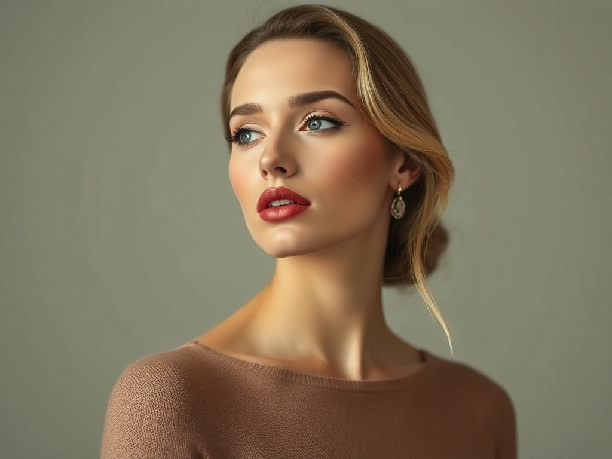


*Professional portrait enhancement results*

#### Business Photography Gallery
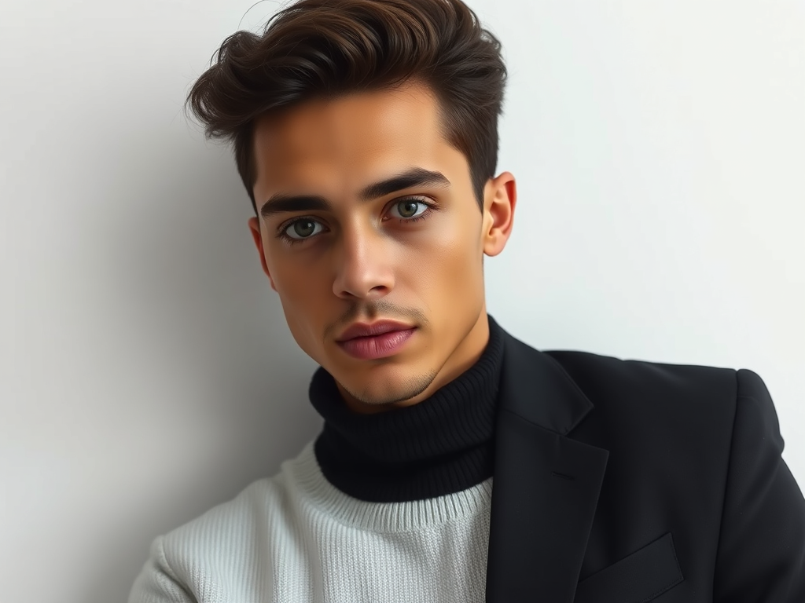


*Business and corporate photography enhancements*

---

## 🔧 Technical Interface

### ⚙️ Advanced Controls

#### Style Customization
- **Intensity Slider**: Fine-tune effect strength
- **Style Presets**: One-click style application
- **Custom Parameters**: Advanced user controls
- **Preview Mode**: Real-time effect preview

#### Processing Options
- **Quality Settings**: Resolution and compression options
- **Format Selection**: JPG, PNG, WebP output
- **Batch Processing**: Multiple image handling
- **API Integration**: Developer-friendly endpoints

---

## 📱 Cross-Platform Compatibility

### 🖥️ Desktop Browsers
- **Chrome**: Full feature support
- **Firefox**: Complete compatibility
- **Safari**: Optimized performance
- **Edge**: Native integration

### 📱 Mobile Devices
- **iOS Safari**: Native iOS experience
- **Android Chrome**: Full Android support
- **Mobile Browsers**: Universal compatibility
- **PWA Support**: App-like experience

---

## 🚀 Getting Started Visually

### 📋 Quick Start Guide

#### Step 1: Visit Sybau Picture
```
🌐 https://sybaupicture.com
🇨🇳 https://sybaupicture.com/zh
```

#### Step 2: Choose Your Method
- **Upload Image**: Drag & drop or click to select
- **Enter Text**: Describe what you want to create

#### Step 3: Select Template
- **9 Professional Options**: Choose the best fit
- **Style Variations**: Pick your preferred aesthetic

#### Step 4: Generate & Download
- **15-Second Processing**: Watch the magic happen
- **High-Quality Output**: Professional results ready to use

---

## 📞 Support & Resources

### 🆘 Help Center Screenshots

#### Support Interface
- **Live Chat**: Instant support availability
- **Knowledge Base**: Comprehensive documentation
- **Video Tutorials**: Step-by-step guides
- **Community Forum**: User discussions

#### FAQ Section
- **Common Questions**: Quick answers
- **Troubleshooting**: Problem resolution
- **Best Practices**: Professional tips
- **Feature Updates**: Latest improvements

---

**🌟 Ready to See It in Action?**

[](https://sybaupicture.com)
[](https://sybaupicture.com/zh)
[](https://sybaupicture.com/pricing)

*Professional Results • 15-Second Generation • Try Free Today*

---

## 📝 Screenshot Guidelines

### 📸 For Developers

If you're contributing screenshots, please follow these guidelines:

1. **Resolution**: Minimum 1920x1080 for desktop screenshots
2. **Mobile**: Use iPhone 12/13 Pro dimensions (390x844)
3. **Format**: WebP preferred, PNG acceptable
4. **Compression**: Optimize for web without quality loss
5. **Naming**: Descriptive filenames (e.g., `homepage-hero-desktop.webp`)

### 🎯 Screenshot Locations
```
public/images/
├── hero-showcase/     # Homepage hero section
├── scenarios/         # Template examples
├── examples/          # Before/after comparisons
└── gallery/          # User creation gallery
```

*All screenshots should showcase the live platform at [sybaupicture.com](https://sybaupicture.com)*